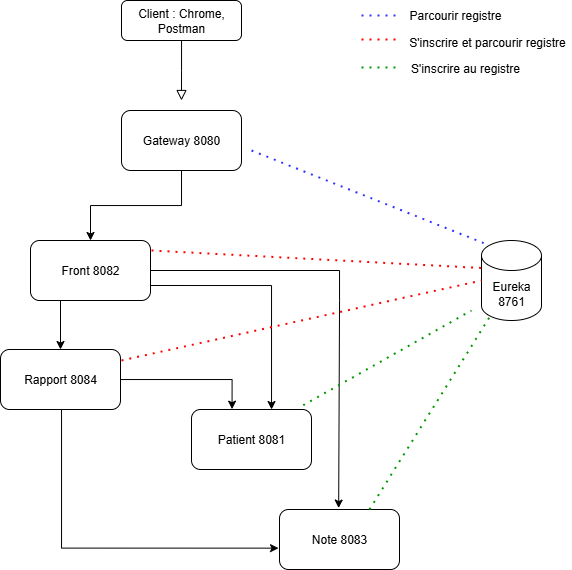

# P9-MediLabo_Solutions

##  Détection du risque de diabète - application en Microservice
Projet de développement Java Spring Boot permettant aux praticiens de consulter, enrichir et évaluer les données médicales de patients afin d'estimer leur risque de développer un diabète de type 2.

##  Architecture 

### Microservices implémentés 
L'application est organisée en **microservices** :
- 'gateway' : microservice de routage basé sur Spring cloud gateway
- 'front'   : interface utilisateur minimale et sobre
- 'patient' : gestion des informations personnelles (BDD relationnelle-SQL : H2, normalisé 3NF car données structurées)
- 'note'    : gestion des observations des médecins (BDD NoSQL : MongoDB car données non structurées)
- 'rapport' : calcul du niveau de risque de diabète
- 'eureka' : service de découverte des microservice qui permet de simplifier la communication, découverte dynamique des services
Chaque microservice est **indépendant, dockérisé**, et communique entre eux. 

###  Technologies
- Java 21
- Spring Boot 
- Sping Data JPA
- Spring Cloud 
- Spring Data MongoDB
- Netflix Eureka (service Discovery)
- OpenFeign (communication interservice)
- Postman 
- Git 
- Thymeleaf 
- Bootstrap 
- HTLM5/CSS3
- Maven 
- junit 5
- Mockito 

### Bases de Données 
- H2 (patients)
- MongoDB (notes)

### Déploiement
- Docker + Docker-compose

###  Qualité et maintenabilité
- respect des principes SOLID et MVC
- Documentation claire (README, endpoints exposés, données de test)
- code testé avec JaCoCo

##  Fonctionnalités attendues
###  Sprint 1 : microservices gestion des patients 
- CRUD complet des patients (consultation, ajout, modification, suppression)
- Recherche, exportation de données
- BDD relationnelle-SQL normalisée en 3NF
- Authentification basique sécurisée via Spring Sécurity
- interface utilisateur initiale (liste + fiche patient)

###  Sprint 2 : microservice notes médicales (MongoDB)
- ajout et consultation libre de notes pour chaque patient
- exportation des notes
- BDD NoSQL MongoDB

###  Sprint 3 : microservice évaluation du risque 
- analyse des notes à la recherche de termes déclencheurs
- calcul du niveau de risque selon l'âge, le sexe, et le nombre de déclencheurs
- affichage du niveau de risque dans la fiche patient (None, Borderline, in Danger, Early Onset)

###  Front-end 
- Affichage liste des patients
- affichage détaillée : données personnelles, notes, risque
- interface simple et intuitive

###  Gateway
- routage des requêtes vers les microservices backend
- centralisation de la sécurité (authentification)

###  Post Sprint  : dockerisation et Green code
- Dockerisation chaque microservice (dockerfile individuel)
- créer un docker-compose.yml global (avec services backend, frontend, gateway, BDD SQL/MAngoDB)
- Recherche personnelle et résumé ci-dessous

##  Installation 

### 1. Prérequis
- Docker : https://www.docker.com/
- Docker-compose : https://docs.docker.com/compose/install/
- volumes persistants : pour les volumes Docker pour MongoDB

### 2. Cloner le repository
- git clone https://github.com/Steephaniie/P9-MediLabo_Solutions
- cd P9-MediLabo_Solutions

## lancement hors Docker

### Compiler chaque projet
$ mvn clean install

### Lancer chaque application 
$ mvn spring-boot:run

### liste des accès
- Front : http://localhost:8082/ (interface utilisateur)
- Eureka dashboard : http://localhost:8761/ (tous les services doivent apparaitre enregistrés)
- Gateway : http://localhost:8080/ (point d'entrée unique)
- Patient : http://localhost:8081/ (gestion des patients)
- Notes : http://localhost:8083/ (gestion des notes)
- Rapport : http://localhost:8084/ (calcul du niveau de risque)
- Base MongoDB : port 27017 (stockage des notes)

##  lancement avec Docker

### Prérequis 
- Docker : https://www.docker.com/
- Docker-compose : https://docs.docker.com/compose/install/
- volumes persistants : pour les volumes Docker pour MongoDB

### lancer tous les services
docker-compose up --build

##  Sécurité - Authentification 
- Utilisation de Spring Security pour l'authentification, configuration centralisé (dans le gateway)
- Utilisation de JWT pour la gestion des tokens
- utilisateurs stockés en mémoire (via config "application.properties")
- pas de gestion de rôles ni inscription dans le respect des besoins du client

### Comptes de connexion (authentification basique)
- stef/stef
- configuration des application.properties de chaque service sécurisé

##  Tests et qualité 
Données de test fournies dans le projet (4 patients types + notes médicales) permettant de reproduire le calcul de risque.

### Tests unitaires et d'intégration 
- JUnit 5 : couverture des services, contrôleurs et calcul du risque
- Mockito : simulation des dépendances (repositories, clients, Feign)
- Test d'intégration : validation des endpoints REST avec SpringBootTest
- Postman : vérification manuelle des endpoints REST (collection incluse dans le projet)

### Génération de rapports de tests 
- Maven Surefire : rapport d'exécution des tests (target/surefire-reports/)
- Jacoco : couverture du code (target/site/jacoco/index.html)

``mvn clean test``

``mvn jacoco:report``

##  Green code - éco-conception 
##  Enjeux
 Le Green code vise à réduire l'empreinte écologique du code en optimisant : 
- la consommation mémoire 
- les cycles CPU
- Le volume de données échangées
- poids des images Docker

##  Bonnes pratiques appliquées
- microservices découplés (chargement limité à ce qui est nécessaire) 
- utilisation de DTO pour ne transférer que des données nécessaires
- Docker multi-stage pour des images compactes
- Authentification centralisée pour limiter les appels redondants

##  Améliorations possibles
- Utilisation des profiles Spring Boot pour limiter la consommation en dev/test (suppression des logs)
- Caching des appels aux microservices (mémorisation des précédentes réponses)

##  Auteure 
Projet réalisé dans le cadre du P9 de la formation Développeur Java - openclassrooms
Stéphanie Leulliette — Développeuse Java Back-End
